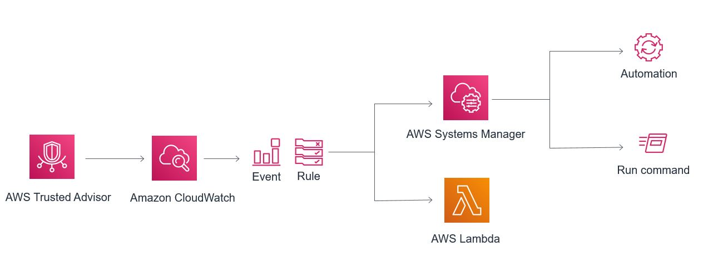

## Trusted Advisor Tools

### Overview
AWS Trusted Advisor provides real time guidance to help users provision their resources following AWS best practices. You can now create configurable, rule-based events for automated actions based on AWS Trusted Advisor’s library of best-practice checks using Amazon CloudWatch Events.
The sample functions provided help to automate Trusted Advisor best practices using Amazon Cloudwatch events and AWS Lambda or SSM Automation. 

### Logic

### Setup and Usage

Setup and usage instructions are present for each tool in its respective directory:  

<table border=0 cellpadding=0 cellspacing=0 width=739 style='border-collapse:
 collapse;table-layout:fixed;width:555pt'>
 <col class=xl663814 width=150 style='mso-width-source:userset;mso-width-alt:
 5485;width:113pt'>
 <col width=468 style='mso-width-source:userset;mso-width-alt:17115;width:351pt'>
 <col width=121 style='mso-width-source:userset;mso-width-alt:4425;width:91pt'>
 <tr height=20 style='height:15.0pt'>
  <td height=20 class=xl673814 width=150 style='height:15.0pt;width:113pt'>Check
  Type</td>
  <td class=xl693814 width=468 style='width:351pt'>Check Name</td>
  <td class=xl683814 width=121 style='width:91pt'>Comment</td>
 </tr>
 <tr height=20 style='height:15.0pt'>
  <td height=20 class=xl653814 style='height:15.0pt'>Cost Optimization</td>
  <td class=xl153814>Underutilized Amazon EBS Volumes</td>
  <td class=xl153814></td>
 </tr>
 <tr height=20 style='height:15.0pt'>
  <td height=20 class=xl653814 style='height:15.0pt'>Cost Optimization</td>
  <td class=xl153814><a href="LowUtilizationEC2Instances/">Low Utilization Amazon EC2 Instances</a></td>
  <td class=xl153814></td>
 </tr>
 <tr height=20 style='height:15.0pt'>
  <td height=20 class=xl653814 style='height:15.0pt'>Cost Optimization</td>
  <td class=xl153814><a href="UnassociatedElasticIPAddresses/README.md">Unassociated Elastic IP Addresses</a></td>
  <td class=xl153814></td>
 </tr>
 <tr height=20 style='height:15.0pt'>
  <td height=20 class=xl653814 style='height:15.0pt'>Cost Optimization</td>
  <td class=xl153814>Idle Load Balancers</td>
  <td class=xl153814></td>
 </tr>
 <tr height=20 style='height:15.0pt'>
  <td height=20 class=xl653814 style='height:15.0pt'>Cost Optimization</td>
  <td class=xl153814>Amazon RDS Idle DB Instances</td>
  <td class=xl153814></td>
 </tr>
 <tr height=20 style='height:15.0pt'>
  <td height=20 class=xl653814 style='height:15.0pt'>Cost Optimization</td>
  <td class=xl153814>Underutilized Amazon Redshift Clusters</td>
  <td class=xl153814></td>
 </tr>
 <tr height=20 style='height:15.0pt'>
  <td height=20 class=xl653814 style='height:15.0pt'>Cost Optimization</td>
  <td class=xl153814>Amazon EC2 Reserved Instances Optimization</td>
  <td class=xl153814></td>
 </tr>
 <tr height=20 style='height:15.0pt'>
  <td height=20 class=xl653814 style='height:15.0pt'>Cost Optimization</td>
  <td class=xl153814>Amazon EC2 Reserved Instance Lease Expiration</td>
  <td class=xl153814></td>
 </tr>
 <tr height=20 style='height:15.0pt'>
  <td height=20 class=xl653814 style='height:15.0pt'>Cost Optimization</td>
  <td class=xl153814>Amazon Route 53 Latency Resource Record Sets</td>
  <td class=xl153814></td>
 </tr>
 <tr height=20 style='height:15.0pt'>
  <td height=20 class=xl653814 style='height:15.0pt'>Fault Tolerance</td>
  <td class=xl153814><a href="AmazonEBSSnapshots/">Amazon EBS Snapshots</a></td>
  <td class=xl153814></td>
 </tr>
 <tr height=20 style='height:15.0pt'>
  <td height=20 class=xl653814 style='height:15.0pt'>Fault Tolerance</td>
  <td class=xl153814>Amazon RDS Backups</td>
  <td class=xl153814></td>
 </tr>
 <tr height=20 style='height:15.0pt'>
  <td height=20 class=xl653814 style='height:15.0pt'>Fault Tolerance</td>
  <td class=xl153814>Amazon EC2 Availability Zone Balance</td>
  <td class=xl153814></td>
 </tr>
 <tr height=20 style='height:15.0pt'>
  <td height=20 class=xl653814 style='height:15.0pt'>Fault Tolerance</td>
  <td class=xl153814>EC2Config Service for EC2 Windows Instances</td>
  <td class=xl153814></td>
 </tr>
 <tr height=20 style='height:15.0pt'>
  <td height=20 class=xl653814 style='height:15.0pt'>Fault Tolerance</td>
  <td class=xl153814>PV Driver Version for EC2 Windows Instances</td>
  <td class=xl153814></td>
 </tr>
 <tr height=20 style='height:15.0pt'>
  <td height=20 class=xl653814 style='height:15.0pt'>Fault Tolerance</td>
  <td class=xl153814>Amazon S3 Bucket Logging</td>
  <td class=xl153814></td>
 </tr>
 <tr height=20 style='height:15.0pt'>
  <td height=20 class=xl653814 style='height:15.0pt'>Fault Tolerance</td>
  <td class=xl153814><a href="S3BucketVersioning/">Amazon S3 Bucket Versioning</a></td>
  <td class=xl153814></td>
 </tr>
 <tr height=20 style='height:15.0pt'>
  <td height=20 class=xl653814 style='height:15.0pt'>Fault Tolerance</td>
  <td class=xl153814>Auto Scaling Group Health Check</td>
  <td class=xl153814></td>
 </tr>
 <tr height=20 style='height:15.0pt'>
  <td height=20 class=xl653814 style='height:15.0pt'>Fault Tolerance</td>
  <td class=xl153814>ELB Connection Draining</td>
  <td class=xl153814></td>
 </tr>
 <tr height=20 style='height:15.0pt'>
  <td height=20 class=xl653814 style='height:15.0pt'>Fault Tolerance</td>
  <td class=xl153814>Amazon RDS Multi-AZ</td>
  <td class=xl153814></td>
 </tr>
 <tr height=20 style='height:15.0pt'>
  <td height=20 class=xl653814 style='height:15.0pt'>Fault Tolerance</td>
  <td class=xl153814>VPN Tunnel Redundancy</td>
  <td class=xl153814></td>
 </tr>
 <tr height=20 style='height:15.0pt'>
  <td height=20 class=xl653814 style='height:15.0pt'>Fault Tolerance</td>
  <td class=xl153814>ELB Cross-Zone Load Balancing</td>
  <td class=xl153814></td>
 </tr>
 <tr height=20 style='height:15.0pt'>
  <td height=20 class=xl653814 style='height:15.0pt'>Fault Tolerance</td>
  <td class=xl153814>Load Balancer Optimization </td>
  <td class=xl153814></td>
 </tr>
 <tr height=20 style='height:15.0pt'>
  <td height=20 class=xl653814 style='height:15.0pt'>Fault Tolerance</td>
  <td class=xl153814>ENA Driver Version for EC2 Windows Instances</td>
  <td class=xl153814></td>
 </tr>
 <tr height=20 style='height:15.0pt'>
  <td height=20 class=xl653814 style='height:15.0pt'>Fault Tolerance</td>
  <td class=xl153814>NVMe Driver Version for EC2 Windows Instances</td>
  <td class=xl153814></td>
 </tr>
 <tr height=20 style='height:15.0pt'>
  <td height=20 class=xl653814 style='height:15.0pt'>Fault Tolerance</td>
  <td class=xl153814>Amazon Route 53 Name Server Delegations</td>
  <td class=xl153814></td>
 </tr>
 <tr height=20 style='height:15.0pt'>
  <td height=20 class=xl653814 style='height:15.0pt'>Fault Tolerance</td>
  <td class=xl153814>AWS Direct Connect Location Redundancy</td>
  <td class=xl153814></td>
 </tr>
 <tr height=20 style='height:15.0pt'>
  <td height=20 class=xl653814 style='height:15.0pt'>Fault Tolerance</td>
  <td class=xl153814>AWS Direct Connect Virtual Interface Redundancy</td>
  <td class=xl153814></td>
 </tr>
 <tr height=20 style='height:15.0pt'>
  <td height=20 class=xl653814 style='height:15.0pt'>Fault Tolerance</td>
  <td class=xl153814>Amazon Route 53 Deleted Health Checks</td>
  <td class=xl153814></td>
 </tr>
 <tr height=20 style='height:15.0pt'>
  <td height=20 class=xl653814 style='height:15.0pt'>Fault Tolerance</td>
  <td class=xl153814>Amazon Route 53 Failover Resource Record Sets</td>
  <td class=xl153814></td>
 </tr>
 <tr height=20 style='height:15.0pt'>
  <td height=20 class=xl653814 style='height:15.0pt'>Fault Tolerance</td>
  <td class=xl153814>Amazon Aurora DB Instance Accessibility</td>
  <td class=xl153814></td>
 </tr>
 <tr height=20 style='height:15.0pt'>
  <td height=20 class=xl653814 style='height:15.0pt'>Fault Tolerance</td>
  <td class=xl153814>AWS Direct Connect Connection Redundancy</td>
  <td class=xl153814></td>
 </tr>
 <tr height=20 style='height:15.0pt'>
  <td height=20 class=xl653814 style='height:15.0pt'>Fault Tolerance</td>
  <td class=xl153814>Auto Scaling Group Resources</td>
  <td class=xl153814></td>
 </tr>
 <tr height=20 style='height:15.0pt'>
  <td height=20 class=xl653814 style='height:15.0pt'>Fault Tolerance</td>
  <td class=xl153814>Amazon Route 53 High TTL Resource Record Sets</td>
  <td class=xl153814></td>
 </tr>
 <tr height=20 style='height:15.0pt'>
  <td height=20 class=xl653814 style='height:15.0pt'>Performance</td>
  <td class=xl153814>CloudFront Alternate Domain Names</td>
  <td class=xl153814></td>
 </tr>
 <tr height=20 style='height:15.0pt'>
  <td height=20 class=xl653814 style='height:15.0pt'>Performance</td>
  <td class=xl153814>Large Number of EC2 Security Group Rules Applied to an
  Instance</td>
  <td class=xl153814></td>
 </tr>
 <tr height=20 style='height:15.0pt'>
  <td height=20 class=xl653814 style='height:15.0pt'>Performance</td>
  <td class=xl153814>Large Number of Rules in an EC2 Security Group</td>
  <td class=xl153814></td>
 </tr>
 <tr height=20 style='height:15.0pt'>
  <td height=20 class=xl653814 style='height:15.0pt'>Performance</td>
  <td class=xl153814>Amazon Route 53 Alias Resource Record Sets</td>
  <td class=xl153814></td>
 </tr>
 <tr height=20 style='height:15.0pt'>
  <td height=20 class=xl653814 style='height:15.0pt'>Performance</td>
  <td class=xl153814>Service Limits</td>
  <td class=xl153814></td>
 </tr>
 <tr height=20 style='height:15.0pt'>
  <td height=20 class=xl653814 style='height:15.0pt'>Performance</td>
  <td class=xl153814>CloudFront Header Forwarding and Cache Hit Ratio</td>
  <td class=xl153814></td>
 </tr>
 <tr height=20 style='height:15.0pt'>
  <td height=20 class=xl653814 style='height:15.0pt'>Performance</td>
  <td class=xl153814>Amazon EBS Provisioned IOPS (SSD) Volume Attachment
  Configuration</td>
  <td class=xl153814></td>
 </tr>
 <tr height=20 style='height:15.0pt'>
  <td height=20 class=xl653814 style='height:15.0pt'>Performance</td>
  <td class=xl153814>CloudFront Content Delivery Optimization</td>
  <td class=xl153814></td>
 </tr>
 <tr height=20 style='height:15.0pt'>
  <td height=20 class=xl653814 style='height:15.0pt'>Performance</td>
  <td class=xl153814>Overutilized Amazon EBS Magnetic Volumes</td>
  <td class=xl153814></td>
 </tr>
 <tr height=20 style='height:15.0pt'>
  <td height=20 class=xl653814 style='height:15.0pt'>Performance</td>
  <td class=xl153814>High Utilization Amazon EC2 Instances</td>
  <td class=xl153814></td>
 </tr>
 <tr height=20 style='height:15.0pt'>
  <td height=20 class=xl653814 style='height:15.0pt'>Performance</td>
  <td class=xl153814>Amazon EC2 to EBS Throughput Optimization</td>
  <td class=xl153814></td>
 </tr>
 <tr height=20 style='height:15.0pt'>
  <td height=20 class=xl653814 style='height:15.0pt'>Security</td>
  <td class=xl153814>Security Groups - Unrestricted Access</td>
  <td class=xl153814></td>
 </tr>
 <tr height=20 style='height:15.0pt'>
  <td height=20 class=xl653814 style='height:15.0pt'>Security</td>
  <td class=xl153814>AWS CloudTrail Logging</td>
  <td class=xl153814></td>
 </tr>
 <tr height=20 style='height:15.0pt'>
  <td height=20 class=xl653814 style='height:15.0pt'>Security</td>
  <td class=xl153814>Security Groups - Specific Ports Unrestricted</td>
  <td class=xl153814></td>
 </tr>
 <tr height=20 style='height:15.0pt'>
  <td height=20 class=xl653814 style='height:15.0pt'>Security</td>
  <td class=xl153814>IAM Access Key Rotation</td>
  <td class=xl153814></td>
 </tr>
 <tr height=20 style='height:15.0pt'>
  <td height=20 class=xl653814 style='height:15.0pt'>Security</td>
  <td class=xl153814>IAM Password Policy</td>
  <td class=xl153814></td>
 </tr>
 <tr height=20 style='height:15.0pt'>
  <td height=20 class=xl653814 style='height:15.0pt'>Security</td>
  <td class=xl153814>Amazon S3 Bucket Permissions</td>
  <td class=xl153814></td>
 </tr>
 <tr height=20 style='height:15.0pt'>
  <td height=20 class=xl653814 style='height:15.0pt'>Security</td>
  <td class=xl153814>ELB Listener Security</td>
  <td class=xl153814></td>
 </tr>
 <tr height=20 style='height:15.0pt'>
  <td height=20 class=xl653814 style='height:15.0pt'>Security</td>
  <td class=xl153814>CloudFront SSL Certificate on the Origin Server</td>
  <td class=xl153814></td>
 </tr>
 <tr height=20 style='height:15.0pt'>
  <td height=20 class=xl653814 style='height:15.0pt'>Security</td>
  <td class=xl153814>ELB Security Groups</td>
  <td class=xl153814></td>
 </tr>
 <tr height=20 style='height:15.0pt'>
  <td height=20 class=xl653814 style='height:15.0pt'>Security</td>
  <td class=xl153814>Amazon Route 53 MX Resource Record Sets and Sender Policy
  Framework</td>
  <td class=xl153814></td>
 </tr>
 <tr height=20 style='height:15.0pt'>
  <td height=20 class=xl653814 style='height:15.0pt'>Security</td>
  <td class=xl153814>IAM Use</td>
  <td class=xl153814></td>
 </tr>
 <tr height=20 style='height:15.0pt'>
  <td height=20 class=xl653814 style='height:15.0pt'>Security</td>
  <td class=xl153814>MFA on Root Account</td>
  <td class=xl153814></td>
 </tr>
 <tr height=20 style='height:15.0pt'>
  <td height=20 class=xl653814 style='height:15.0pt'>Security</td>
  <td class=xl153814><a href="ExposedAccessKeys/">Exposed Access Keys</a></td>
  <td class=xl153814></td>
 </tr>
 <tr height=20 style='height:15.0pt'>
  <td height=20 class=xl653814 style='height:15.0pt'>Security</td>
  <td class=xl153814>Amazon RDS Security Group Access Risk</td>
  <td class=xl153814></td>
 </tr>
 <tr height=20 style='height:15.0pt'>
  <td height=20 class=xl653814 style='height:15.0pt'>Security</td>
  <td class=xl153814><a href="AmazonEBSPublicSnapshots/">Amazon EBS Public Snapshots</a></td>
  <td class=xl153814></td>
 </tr>
 <tr height=20 style='height:15.0pt'>
  <td height=20 class=xl653814 style='height:15.0pt'>Security</td>
  <td class=xl153814><a href="AmazonRDSPublicSnapshots/">Amazon RDS Public Snapshots</a></td>
  <td class=xl153814></td>
 </tr>
 <tr height=20 style='height:15.0pt'>
  <td height=20 class=xl653814 style='height:15.0pt'>Security</td>
  <td class=xl153814>CloudFront Custom SSL Certificates in the IAM Certificate
  Store</td>
  <td class=xl153814></td>
 </tr>
 <![if supportMisalignedColumns]>
 <tr height=0 style='display:none'>
  <td width=150 style='width:113pt'></td>
  <td width=468 style='width:351pt'></td>
  <td width=121 style='width:91pt'></td>
 </tr>
 <![endif]>
</table>

More information about Trusted Advisor is available here: https://aws.amazon.com/premiumsupport/trustedadvisor/
